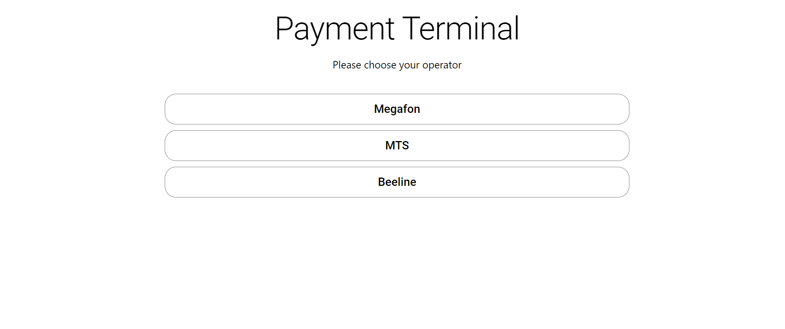
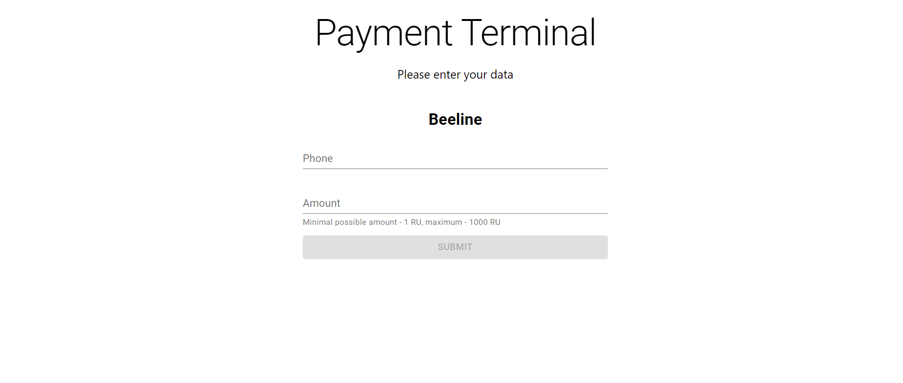

# Payment Terminal

As part of this task, I developed (HTML/CSS-coding and implement client-side logic) application interface for the terminal providing the service of refilling the balance of cellular operators.

### Main Screen

### Terminal

## Application Features

- Possibility to choose a mobile operator
- Replenishment of the balance of the phone number

## Stack Technologies

- React
- Material UI

## Testing

To test the application, you need to enter the following commands:

You need to clone the repository using the command: `git@github.com:ToxichQQQ/payment-terminal.git`

After the repository has been copied, go to the repository and run the `npm install` command.

Start the application using the `npm start`

## Thanks for your attention

You can contact me by this email storozhenko.dev@gmail.com
